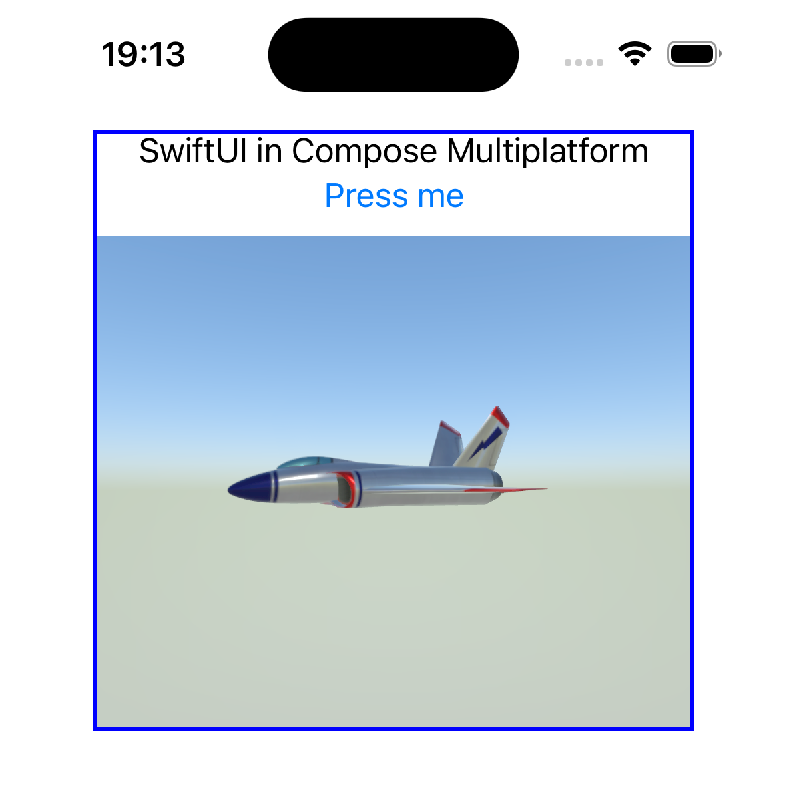

# Embedded SwiftUI view in Compose Multiplatform example



This example shows a SceneKit 3d model in SwiftUI embedded in a Compose Multiplatform view, being
rotated by websocket events.

In more detail:

- Websocket server sends random numbers to the client
- On iOS, the websocket numbers are used to animate the 3d model's rotation
- On other platforms, the view is a text label that displays the websocket numbers

I did this to explore embedding native iOS views in Compose Multiplatform, and bidirectional control
flow.

### Run:

Start the server

```
./gradlew :server:run
```

Then start any of the apps.
